# Tether User Guide

_What if you could enjoy the dynamic nature of professional Applicant Tracking Systems combined with the timeless 
simplicity of tracking tools like Excel?_

Welcome to Tether, the everyday Hiring Manager's **desktop app** for managing applicants, interviewers and interviews. 
It's optimized for use via a Command Line Interface (CLI) while still having the benefits of a Graphical User Interface 
(GUI).

**If you can type fast**, Tether can get your hiring management tasks done faster than traditional GUI apps.

<!-- * Table of Contents -->
<page-nav-print />

--------------------------------------------------------------------------------------------------------------------

## Quick start

1. Ensure you have Java `11` or above installed in your Computer.

1. Download the latest `tether.jar` from [here](https://github.com/AY2324S2-CS2103T-F11-3/tp/releases/tag/v1.3).

1. Copy the file to the folder you want to use as the _home folder_ for your Tether.

1. Open a command terminal, `cd` into the folder you put the jar file in, and use the `java -jar tether.jar`
   command to run the application.<br><br>
   A GUI similar to the below should appear in a few seconds. Note how the app contains some sample data.<br>
   


5. Type commands in the command box and press Enter to execute them.
6. Refer to the [Features](#features) below for details of available commands.


--------------------------------------------------------------------------------------------------------------------

## Using Features Error-Free

**Notes about the command format:**<br>

* Command names are case-sensitive.<br>
 e.g if the user types `ADD_APPLICANT` instead of `add_applicant`, it is interpreted as a invalid command.

* Tether will give as specific feedback **as possible** if any parameter constraints for commands are violated. Parameter constraints
will be listed along with the commands that **first** use them (i.e. the same parameter constraints will not be 
explained everytime the parameter is used, only the first time).

* Extraneous parameters for commands that do not take in any parameters **at all** (`help`, `clear`, `exit`, `view_overall_statistics`) will be
  ignored. For example, if you attempt to execute `help 123`, it will be interpreted as `help`.

* If you are using a PDF version of this document, be careful when copying and pasting commands that span multiple lines
  as space characters surrounding line-breaks may be omitted when copied over to the application.
  </box>

**Note about directly editing the addressbook.json file:**

* We give you the freedom to make any edits to the addressbook.json file but do note that if any invalid edits are made to the addressbook.json before (re)launching the application, then no data will load and an exception will be viewed in the terminal.
  * What count as invalid edits? Simply speaking, edits that violate the **parameter constraints** of the fields of the 
  JSON entries. For example, editing a `name` to be an emoji, or an email to be `null`.
  * What **do not** count as invalid edits? Edits which violate any **business constraints** imposed by Tether. For 
  example, editing all persons to have the same email when emails are required
  to be unique.

## Gathering your bearings ##
Before delving into the features, we want you to give you a brief tour on how to use our application in the first place. 
After all, Tether is not your typical application that you may be accustomed to using off the App Store and does come with a bit of a learning curve. 

### The structure of Tether

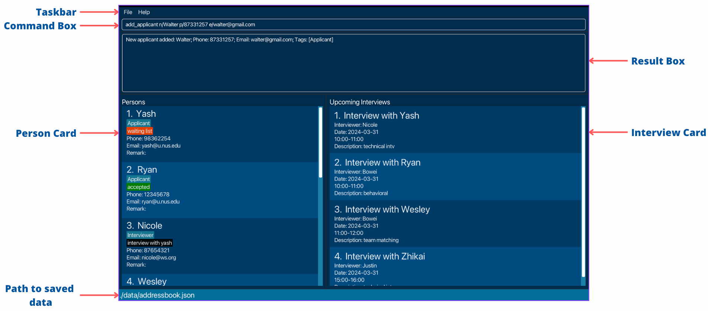

1. Taskbar: where you may click on either the _File_ or _Help_ buttons.
2. Command Box: where commands are executed.
3. Result Box: where success or error messages, if any, for executed commands are displayed
    * Note that the Result Box may not necessarily refresh everytime a new command is executed. This may happen if, as an example, a command incurs a fatal error before it can generate a result.
4. Person/Interview Card: where the details of each applicant/interviewer and interview you add are displayed

### Help yourself!

Simply execute `help` or press the _Help_ button in the taskbar to launch a help window such as the one below:

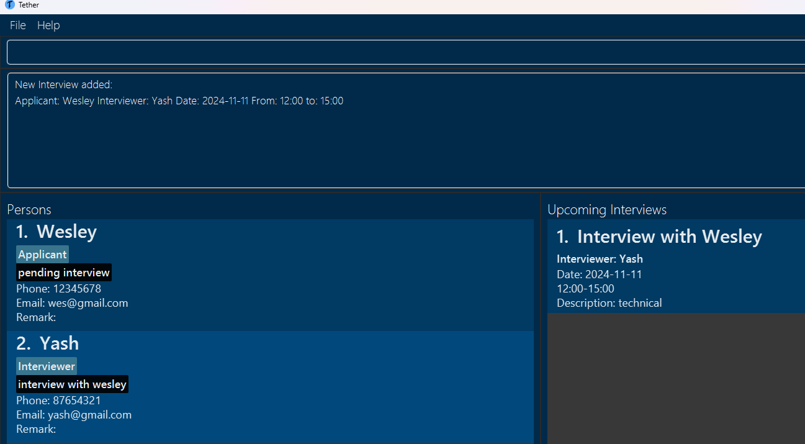

## Features

Now that we've gone over the basics, let's dive into how you may use Tether for your most essential hiring management tasks!

### Adding an applicant:

One of the first steps in the hiring pipeline is when an applicant submits their name for consideration. 

To record an applicant and their contact details in Tether, simply execute `add_applicant n/NAME p/PHONE e/EMAIL` and the applicant will appear under the _Persons_ column as seen via the example usage below.

**Example usage**:
* `add_applicant n/Wesley Yu p/88889999 e/wesleyyu@gmail.com`

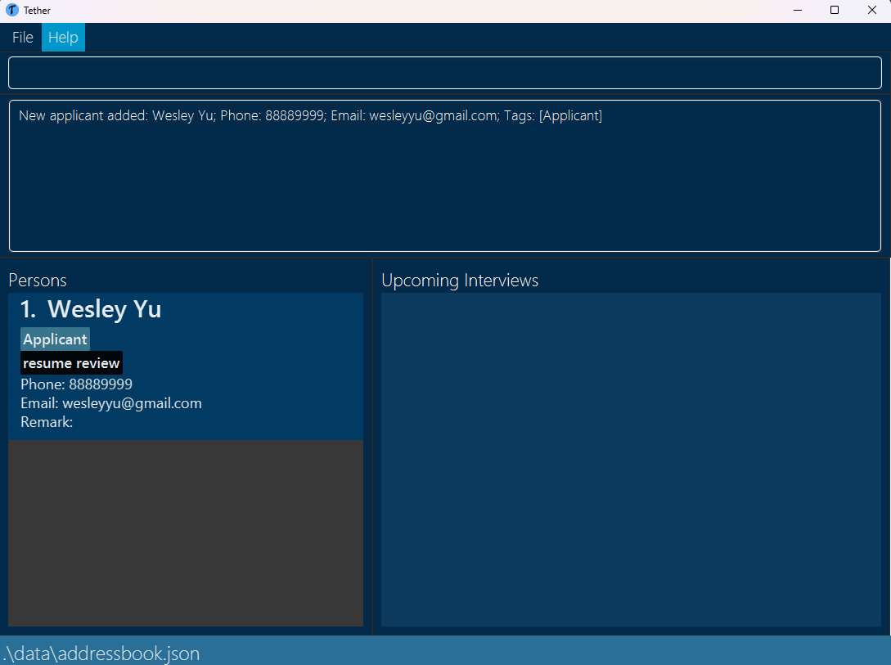

**Parameter constraints**:
* Names can only contain alphanumeric characters and spaces, and should not be blank.
* Phone numbers must be at least 3 digits long and strictly only contain numbers (i.e. no spaces or dashes).
* Emails should be of the format local-part@domain and adhere to the following constraints:
  * The local-part should only contain alphanumeric characters and these special characters, excluding the parentheses, (+_.-). The local-part may not start or end with any special characters. 
  * This is followed by a '@' and then a domain name. The domain name is made up of domain labels separated by periods.
   The domain name must:
    - end with a domain label at least 2 characters long
    - have each domain label start and end with alphanumeric characters
    - have each domain label consist of alphanumeric characters, separated only by hyphens, if any.

**Notes**:
* Different applicants with the same name can be added as long as their phone numbers and emails are different.
* Applicants' remark field will be empty by default and can only be edited later with the `remark` command (described below).

### Adding a status to an applicant:

Now that you know how to add an applicant, it would be nice to record their position in your hiring pipeline at any given time for later review. This is where tagging applicants by status is handy.

Simply execute `applicant_status PHONE s/STATUS` where PHONE is the target applicant's phone number and STATUS may **only** be any one of:
- "Resume review": for when an applicant has only just entered your hiring pool. Note that **this is the default status an applicant receives** when first added.
- "Pending interview": for when you are satisfied with an applicant's potential and have set up or are in the process of scheduling an interview for them.
- "Completed interview": as the natural successor to the previous status.
- "Waiting list": if you - or more specifically the interviewer - are not quite sure about an applicant's future. This status has a <span style="color: orange;">bright orange</span> backing in Tether to remind you to reconcile the respective applicant's fate!
- "Accepted": in the case that an applicant has impressed their interviewer enough for you to send a happy email <span style="color: green;">as soon as possible</span>.
- "Rejected": for the <span style="color: red;">unfortunate</span> case....

**Example Usage**

* `applicant_status 98362254 s/accepted`.

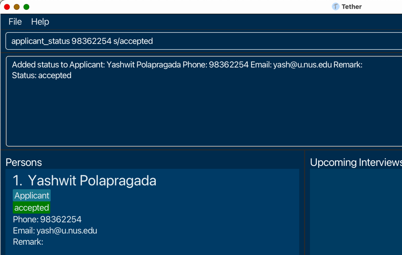

**Parameter Constraints**
* A status may strictly only be any of the statuses enumerated above. However, the status parameter is case-insensitive i.e. `s/accepted` is as valid as `s/AcCepTed`.
* If multiple valid status parameters are passed, such as `add_applicant PHONE s/accepted s/rejected`, then only the last status will be considered. I.e, the applicant's status will become _rejected_
* If multiple valid statuses are passed through one status parameter, such as `add_applicant PHONE s/accepted rejected`, then an error will be displayed since "accepted rejected" is not any one of the valid statuses. I.e, whatever follows the `s/` prefix is considered as one status.

**Notes**:

* The `applicant_status` command **overwrites** the applicant's current status. Ultimately, we want you to be able to pivot your applicants to any stage of the hiring pipeline
* If you schedule an interview with a particular applicant, the applicant's status will change automatically from "resume review" to "pending interview". Conversely, if you delete an interview involving an applicant, their status will revert to "resume review" regardless of what their previous status was.

### Adding an interviewer:
Recording all potential applicants is one thing, but to meaningfully schedule interviews for them, you also need a host of interviewers and their details.

To record an applicant and their contact details in Tether, simply execute `add_interviewer n/NAME p/PHONE e/EMAIL` and the interviewer will appear under the _Persons_ column as seen via the example usage below.

**Example Usage**
* `add_interviewer n/Yash p/99998888 e/yash@gmail.com`

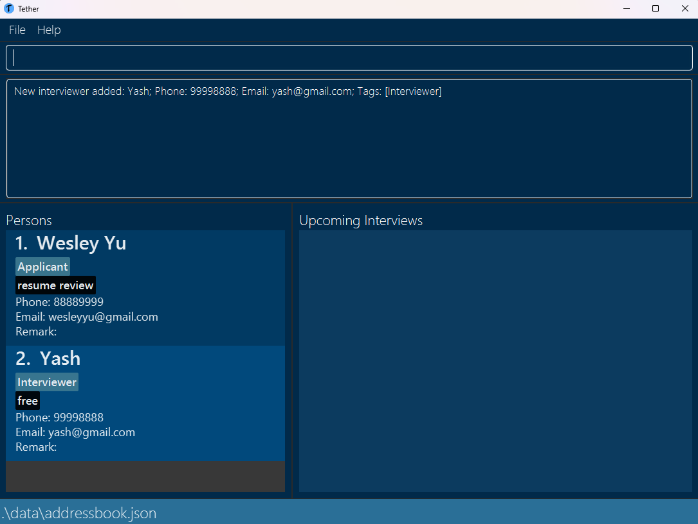

**Notes**:
* Similar to applicants, different interviewers with the same names can be added as long as their phone numbers and emails are different.
* Interviewers' remark field will be empty by default and can only be edited later with the `remark` command (described below).

### Adding a status to an interviewer:

Now that you know how to add an interviewer, it would be nice to record their availabilities at any given time for subsequent interview scheduling. Happily however, there's no need to worry about using any commands to manage interviewer statuses manually!

Tether is capable of tagging an interviewer with a status _automatically_ when an interview concerning the respective interviewer is added. As a specific example, if an interview is scheduled between applicant Wesley and interviewer Yash, then Yash is given a status of _interview with wesley_.

As more interviews are added, the interviewer's statuses stack on top of each other: 

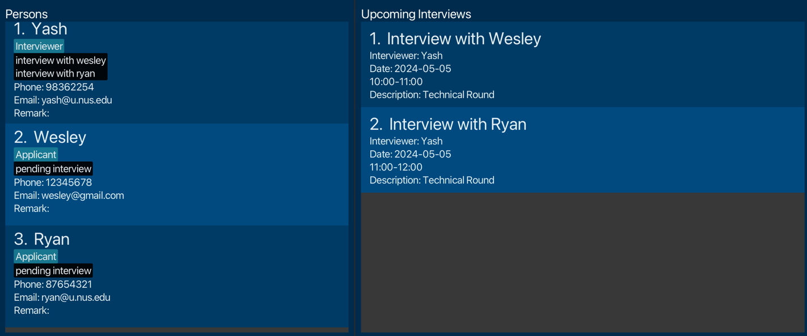

Conversely, if an interview is deleted, the respective status is automatically removed from the interviewer's status stack: 

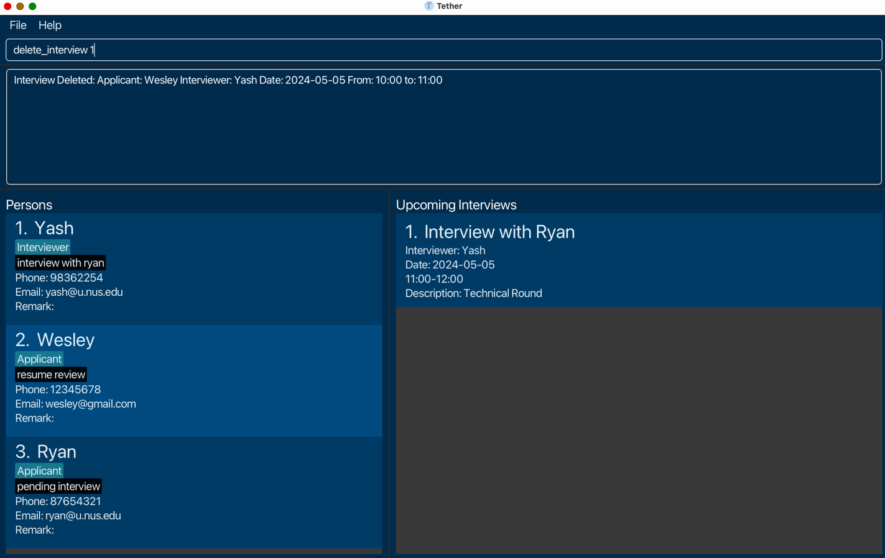

### Adding a remark to an applicant/interviewer:

Once you have applicants/interviewers in Tether, wouldn't it be nice to annotate your applicants/interviewers with helpful remarks?

Simply execute `remark INDEX r/REMARK` and the interview will appear under the _Upcoming Interviews_ column.

**Example Usage**

* `remark 1 r/Confident` would add the 
"Confident" remark to the applicant/interviewer at index 1.

**Parameter Constraints**
* The INDEX of the person to be removed has to be within the bounds of the number of people currently in the list. I.e. executing `remark -2 r/Confident` when there can't be a negative amount of people, or `remark 100 r/Confident` when there's only 20 people, will both lead to errors.

**Notes**
* If you only execute `remark INDEX` without any parameters, the remark of the person at that index will be removed.


### Adding an interview:

Now comes a very meaty part of hiring management - scheduling interviews. And to do so, simply execute `add_interview desc/DESCRIPTION date/DATE st/START_TIME et/END_TIME a/APPLICANT_PHONE_NUMBER i/INTERVIEWER_PHONE_NUMBER` t

The following example usage demonstrates the effect of adding an interview in this manner:

**Example Usage**
* `add_interview desc/technical date/2024-11-11 st/12:00 et/15:00 a/12345678 i/87654321`.


**Parameter Constraints**
* If you would like to not have a description, simply pass an empty parameter`desc/`.
* Dates must be in `YYYY-MM-DD` format
* Times must be in either `HH:MM` or `HH:MM:SS` format

**Notes**:

* You can still schedule new interviews for applicants who have already been rejected or accepted. This is simply to accommodate the possibility of follow-up interviews, amongst other possibilities.
* Entering dates that have already passed are not allowed.

### Listing all persons:

After adding multiple applicants/interviews into Tether, its often necessary to view all of them and their details together.

Although the list of persons and their details are displayed on the left side of the GUI by default and is updated automatically
whenever new persons are added, there are ```find``` and `filter` commands (explained below) that filter the list of persons displayed. If you have executed any of these commands and want to revert to the original unfiltered list of persons, just execute `list_persons`. 

### Listing all the interviews:

After adding multiple interviews into Tether, its often necessary to view all of them and their details together.

Although the list of interviews and their details are displayed on the right side of the GUI by default and is updated automatically
whenever new interviews are added, there is a `filter` commands (explained below) that filters the list of interviews displayed. If you have executed this command and want to revert to the original unfiltered list of interviews, just execute `list_interviews`.

### Finding persons:

After adding multiple persons into Tether, you find yourself having to manually scroll to locate specific person entries. 
The `find` command is useful here to save you time in locating such entries provided you already know at least one of 
the following 3 details of the person: their email, name or phone number.

If you use email or phone number, note that they have to match exactly to locate the person entry if it exists. 
If you use name, a full name is not required but the name provided should be complete. Otherwise, there will also be no matching entries.

The command accepts all inputs, **including invalid ones** (however, no matching entries will be displayed in such cases).

`find` can also be used to find multiple entries at once. You can provide multiple keywords after the initial 
`find_[email/name/phone]` and all entries that match any of the keywords will be displayed. Note that all the keywords 
provided should be of the same type. For example, `find_phone` should only be followed by valid phone number(s), not 
emails or names.

To find a person or persons, execute `find_[email/name/phone] [keyword 1]...` such as in the example usages illustrated below:

**Example Usage**:

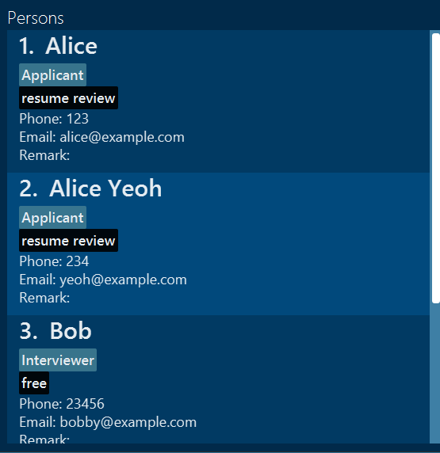

Assume that the above list reflects the current data present in Tether for the upcoming example commands.

Multiple matching entries:
Executing `find_name Alice` will list all entries with the name `Alice` even if it is not a full name as stated earlier as seen below:

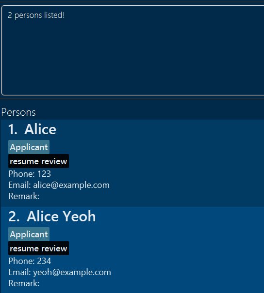

Keyword has to be complete:
Executing `find_name Ali` will not display any matching entries even though `Ali` is a substring of `Alice`.
`0 persons listed!` is the response for such cases of no matching entries as seen below:

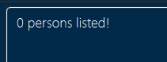

Nonsense keyword inputs:
Executing `find_email 123456` will likewise result in no matching entries. Not that while the value `123456` is not a valid `email`, the command still accepts it and just displays no matching entries. Result display is similar to above

Multiple Keywords:
Executing `find_phone 123 23456` will display the entries that have `123` or `23456` as their phone numbers

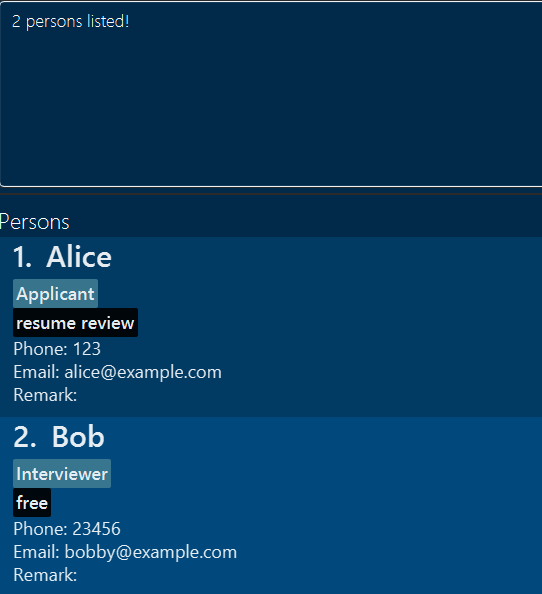

### Filtering persons by status:

What if you have no information about an applicant or interviewer's name, phone or email though? Fret not, for the `filter_by_status` command enables you to narrow down the current list of persons on the basis of their current status.

Simply execute `filter_by_status STATUS`, and the displayed list will update to show only persons with the required status.

**Example Usage**
* `filter_by_status free` will display all interviewers with status _free_.
* `filter_by_status interview with wesley` will display all interviewers containing a status _interview with wesley_ in their status list.

**Parameter Constraints**
* STATUS may be any one of the valid statuses enumerated in `applicant_status` and `interviewer_status` commands above.

**Notes**
* As of now, there is only support for a single status parameter.
* If you want to apply filters one-after-the-other seamlessly, you will have to do this manually. I.e. after applying `filter_by_status free`, you will need to `list_persons` again before applying `filter_by_status interview with wesley`. 
  * If you don't, then the filters will stack on top of the other and you will be searching for people with status _interview with wesley_ **among** those with status _free_, which would result in finding people at all.  
* No persons will be displayed if there are no persons with the given status
* Unlike for the `find` command, statuses must be matched exactly i.e. `filter_by_status interview with wes` will not match an interviewer with status _interview with wesley_

### Filtering interviews by date:

After adding multiple interview entries into Tether, if you want to find all the interviews on a particular date, it can be quite cumbersome to eyeball the entire list.
The `filter_interviews_by_date` command would be very helpful in such situations so that you can locate interviews scheduled on a particular date.

Simply execute `filter_interviews_by_date YYYY-MM-DD` to get all the interviews on `YYYY-MM-DD`.

**Example Usage**
* `filter_interviews_by_date 2024-05-05` to display all interviews on 2024-05-05.

To revert to the original unfiltered list, simply enter the `list_interviews` command.

**Notes**
* No interviews would be displayed if there are no interviews on that day.

### Deleting an applicant/interviewer:

If you're confident in removing an applicant or interviewer from Tether if for example an interviewer leaves your company or an applicant is out of the hiring process, then execute `delete_person PHONE`

**Example Usage**:

* `delete_person 81239123` would delete that
  applicant/interviewer.

## Deleting an interview : `delete_interview`

If you're confident in unscheduling an interview perhaps due to changed availability or an unexpected clash, then execute `delete_interview INDEX`

**Example Usage**:

* `delete_interview 1` would delete the first interview in the list.

## View overall statistics:

Core features such as adding, finding, statuses and deleting are likely going to be your bread and butter as a hiring manager. However often you may be tasked to analyse and report certain statistics that may be tedious to compute manually. 

Tether has some basic support for viewing statistics, particularly: 
- Total number of applicants as well as applicant numbers by status
- Total number of interviewers as well as interviewer numbers by status
- Total number of interviews

A simple example usage would be `view_overall_statistics` to get a result as such: 


### Clear all existing data:

Made multiple mistakes and wish to rebuild your hiring data from scratch? The `clear` command deletes all existing data in Tether, giving you the fresh start you require.

**Note** that this action is irreversible. The moment you enter the command and see the success message `Addressbook has been cleared!`, ALL your data will be deleted permanently. Do exercise caution with this particular command by making an independent copy of your data before clearing it.

### Exiting the program:

If you're clocking out for the day, either execute `exit` directly or press the _File_ button in the taskbar and then press _Exit_ to quit Tether.

### Saving the data

Tether's applicant/interviewer data are saved in the hard disk automatically after any command that changes the data.

There is **no need** to save manually.


--------------------------------------------------------------------------------------------------------------------

## FAQ

**Q**: How do I transfer my data to another Computer?<br>
**A**: Install the app in the other computer and overwrite the empty data file it creates with the file that contains
the data of your previous Tether home folder.


--------------------------------------------------------------------------------------------------------------------

## Command summary

| Action                        | Format, Examples                                                                                                                                                                                                      |
|-------------------------------|-----------------------------------------------------------------------------------------------------------------------------------------------------------------------------------------------------------------------|
| **Add Applicant**             | `add_applicant n/NAME p/PHONE e/EMAIL` <br> e.g., `add_applicant n/John Doe p/81239123 e/johndoe123@gmail.com`                                                                                                        |
| **Change Applicant Status**   | `applicant_status PHONE s/STATUS` <br> e.g., `applicant_status 81239123 s/accepted`                                                                                                                                   |
| **Add Interviewer**           | `add_interviewer n/NAME p/PHONE e/EMAIL` <br> e.g., `add_interviewer n/Jane Doe p/81239123 e/janed@example.com`                                                                                                       |
| **Change Interviewer Status** | `interviewer_status PHONE s/STATUS` <br> e.g., `interviewer_status 81239123 s/free`                                                                                                                                   |
| **Add Interview**             | `add_interview desc/DESCRIPTION date/DATE st/START_TIME et/END_TIME a/APPLICANT_PHONE i/INTERVIEWER_PHONE`<br> e.g., `add_interview desc/Interview with John date/2024-11-11 st/10:00 et/11:00 a/81239123 i/91238123` |
| **Delete Person**             | `delete_person PHONE` <br> e.g., `delete_person 81239123`                                                                                                                                                             |
| **Delete Interview**          | `delete_interview INDEX`<br> e.g., `delete_interview 1`                                                                                                                                                               |
| **List Interviews**           | `list_interviews`                                                                                                                                                                                                     |
| **List Persons**              | `list_persons`                                                                                                                                                                                                        |
| **Find Persons**              | `find_[email/name/phone] [keyword 1]...` <br> e.g., `find_name Alice` or `find_phone 123 456 789`                                                                                                                     |
| **Filter Persons by Status**  | `filter_by_status STATUS`  <br> e.g., `filter_by_status free`                                                                                                                                                         |
| **Filter Interviews by date** | `filter_interviews_by_date YYYY-MM-DD`  <br> e.g., `filter_interviews_by_date 2024-05-05`                                                                                                                             |
| **View Overall Statistics**   | `view_overall_statistics`                                                                                                                                                                                             |
| **Clear All Existing Data**   | `clear`                                                                                                                                                                                                               |
| **Exit**                      | `exit`                                                                                                                                                                                                                |
| **Help**                      | `help`                                                                                                                                                                                                                |
