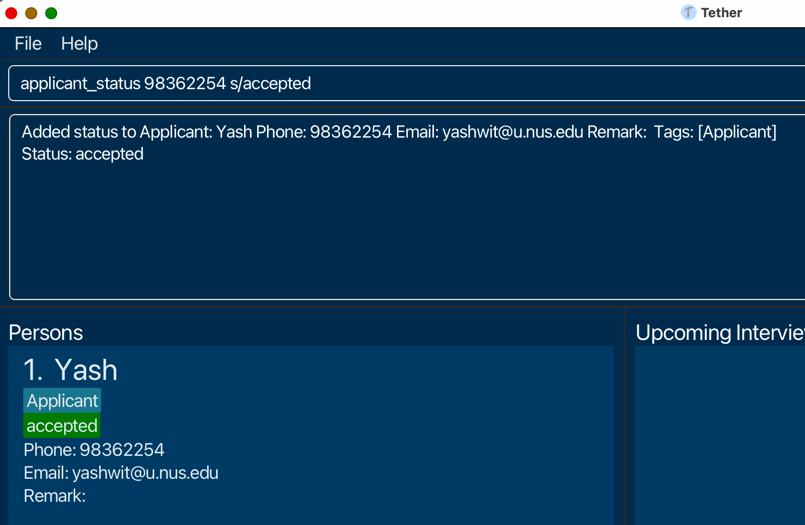

# Tether User Guide

Tether is the everyday Hiring Manager's **desktop app** for managing applicants, interviewers and interviews. It's optimized for use via a Command Line Interface (CLI)
while still having the benefits of a Graphical User Interface (GUI).

**If you can type fast**, Tether can get your hiring management tasks done faster than traditional GUI apps.

<!-- * Table of Contents -->
<page-nav-print />

--------------------------------------------------------------------------------------------------------------------

## Quick start

1. Ensure you have Java `11` or above installed in your Computer.

1. Download the latest `tether.jar` from [here](https://github.com/AY2324S2-CS2103T-F11-3/tp/releases/tag/v1.3).

1. Copy the file to the folder you want to use as the _home folder_ for your Tether.

1. Open a command terminal, `cd` into the folder you put the jar file in, and use the `java -jar tether.jar`
   command to run the application.<br><br>
   A GUI similar to the below should appear in a few seconds. Note how the app contains some sample data.<br>
   


5. Type commands in the command box and press Enter to execute them.
6. Refer to the [Features](#features) below for details of available commands.


--------------------------------------------------------------------------------------------------------------------

## Features


**Notes about the command format:**<br>

* Command names are case-sensitive.<br>
 e.g if the user types `ADD_APPLICANT`, it is interpreted as a invalid command.

* The application will give feedback if any parameter constraints for commands are violated

* Optional parameters are wrapped in `[]`.

* Extraneous parameters for commands that do not take in any parameters **at all** (`help`, `exit`, `view_overall_statistics`) will be
  ignored.<br>
  e.g. if the command specifies `help 123`, it will be interpreted as `help`.

* If you are using a PDF version of this document, be careful when copying and pasting commands that span multiple lines
  as space characters surrounding line-breaks may be omitted when copied over to the application.
  </box>

**Note about directly editing the addressbook.json file:**

* We give you the freedom to make any edits to the addressbook.json file but do not that if any invalid edits (such as adding in `null`, non-english alphabet or emojis) are made to the addressbook.json before (re)launching the application, then no data will load and an exception will be viewed in the terminal. 


## Adding an applicant: `add_applicant`

Format: `add_applicant n/NAME p/PHONE e/EMAIL [t/TAG]`

Examples:

* `add_applicant n/John Doe p/81239123 e/johndoe123@gmail.com`
* `add_applicant n/John Doe p/81239123 e/johndoe123@gmail.com t/friends t/cool`

## Adding a status to an applicant: `applicant_status`

Now that you know how to add an applicant, it would be nice to record their position in your hiring pipeline at any given time for later review. This is where the applicant_status command is handy.

Simply execute `applicant_status PHONE s/STATUS` where PHONE is the applicant's phone and STATUS may **only** be any one of:
- "Resume review": for when an applicant has only just entered your hiring pool. Note that **this is the default status an applicant receives** when first added.
- "Pending interview": for when you are satisfied with an applicant's potential and have set up or are in the process of scheduling an interview for them.
- "Completed interview": as the natural successor to the previous status.
- "Waiting list": if you - or more specifically the interviewer - are not quite sure about an applicant's future. This status has a <span style="color: orange;">bright orange</span> backing in Tether to remind you to reconcile the respective applicant's fate!
- "Accepted": in the case that an applicant has impressed their interviewer enough for you to send a happy email <span style="color: green;">as soon as possible</span>.
- "Rejected": for the <span style="color: red;">unfortunate</span> case....

A simple example usage would therefore be
`applicant_status 98362254 s/accepted`. Executing this would result in the following display: 



**Notes**:

* The `applicant_status` command **overwrites** the applicant's current status
* For convenience, STATUS is case-insensitive i.e. `s/accepted` is as valid as `s/AcCepTed`.
* If you add an interview, the involved applicant's status will change automatically from "resume review" to "pending interview". Conversely if you delete an interview involving an applicant, their status will _revert_ to "resume review"

## Adding a interviewer: `add_interviewer`

Adds an interviewer to the Tether.

Format: `add_interviewer n/NAME p/PHONE e/EMAIL [t/TAG]`

Examples:

* `add_interviewer n/John Doe p/81239123 e/johndoe123@gmail.com`
* `add_interviewer n/John Doe p/81239123 e/johndoe123@gmail.com t/friends t/cool`


## Adding a status to an interviewer: `interviewer_status`

Now that you know how to add an interviewer, it would be nice to record their availabilities at any given time for subsequent interview scheduling. This is where the `interviewer_status` command is handy.

Simply execute `interviewer_status PHONE s/STATUS` where PHONE is the **interviewer's** phone and STATUS may **only** be any one of:
- "Free": for if an interviewer has no interviews scheduled.
- "Interview with APPLICANT PHONE": for when an interviewer can be matched with a promising applicant. 
  - Since it may not be pleasant to view a litany of phone numbers as interviewer statuses though, Tether will find the applicant name associated with the given phone (assuming it is valid) and display "interview with APPLICANT NAME" instead.

A simple example usage for when manually tweaking an interviewer's status is necessary however, would be
`interviewer_status 98362254 s/interview with 12345678`.

**Notes**:

* As before, STATUS is case-insensitive i.e. `s/interview with 12345678` is as valid as `s/iNtERVIew wIth 12345678`..
* Unlike the `applicant_status` command, the `interviewer_status` only overwrites the existing status if the given status if "free". If the status is "interview with....", the new status is **appended** to the existing one. For example, if interviewer Nicole's current status is "interview with Yash" and you execute `interviewer_status [Nicole's Phone] s/interview with [Ryan's Phone]`, Nicole's current status will become "interview with Yash interview with Ryan" with a **line-break** separating the two
* Tether is capable of appending an interviewer's status _automatically_ with "interview with APPLICANT NAME" when an interview concerning the respective interviewer is added. Conversely if the interview is deleted, the **particular** applicant's "interview with..." is deleted. For example if interviewer Nicole's current status is "interview with Yash interview with Ryan", if you delete an interview with Yash, Nicole's status will become "interview with ryan"
* We give you the freedom to append any number of statuses to an existing interviewer i.e. we **do not** currently check against adding duplicate statuses 

## Adding a interview: `add_interview`

Now that you have applicants and interviewers inside tether, you can create an interview.

The information required would be a description, the date, start time, end time as well as the applicant's phone number and interviewer's phone number.
If you would like to not have a description, simply leave it blank with the keyword `desc/`.
Upon successful addition, the interview will appear under the column named `Upcoming Interviews`.

Simply execute the command show below to start scheduling an interview.
Format: `add_interview desc/DESCRIPTION date/DATE st/START TIME et/END TIME a/APPLICANT'S
    PHONE NUMBER i/INTERVIEWER'S PHONE NUMBER`

A simple example usage would be `add_interview desc/technical date/2024-11-11 st/12:00 et/15:00 a/12345678 i/87654321`. 
Executing this would result in the following display: 


## Listing all persons:

Now that you have added multiple `Applicants` and `Interviewers` into Tether, it would be nice to view them with their 
details simultaneously. The list of persons is displayed on the left side of the GUI by default and is updated 
whenever new persons are added. 

However, there are ```find``` and `filter` commands (explained below) that filter the list of persons displayed. If you have executed any of these commands and want to revert to the original unfiltered list of persons, you can use the command below.

Format: `list_persons`

## Listing all the interviews:

Now that you have added multiple `Interviews` into Tether, it would be nice to view them with their details 
simultaneously. The list of interviews is displayed on the right side of the GUI by default and is updated whenever 
new interviews are added.

However, there is a ```filter_interviews_by_date``` command (explained below) that filters the interviews list in
the UI. If you have filtered the list and want to rever to the the original unfiltered list, you can use the command below.

Format: `list_interviews`

## Finding persons:

After adding multiple persons into Tether, you find yourself having to manually scroll to locate specific person entries. 
The `find` command is useful here to save you time in locating such entries provided you already know at least one of 
the following 3 details of the person: their email, name or phone number.

If you use email or phone number, note that they have to match exactly to locate the person entry if it exists. 
If you use name, a full name is not required but the name provided should be complete. Otherwise, there will also be no matching entries.

The command accepts all inputs, including invalid ones and will only display no matching entries in such cases.

`find` can also be used to find multiple entries at once. You can provide multiple keywords after the initial 
`find_[email/name/phone]` and all entries that match any of the keywords will be displayed. Note that all the keywords 
provided should be of the same type. For example, `find_phone` should only be followed by valid phone number(s), not 
emails or names.

Format: `find_[email/name/phone] [keyword 1]...`

Examples:


Assume that the above list reflects the current data present in Tether for the upcoming example commands.

Multiple matching entries:
Executing `find_name Alice` will list all entries with the name `Alice` even if it is not a full name as stated earlier as seen below:


Keyword has to be complete:
Executing `find_name Ali` will not display any matching entries even though `Ali` is a substring of `Alice`.
`0 persons listed!` is the response for such cases of no matching entries as seen below:


Nonsense keyword inputs:
Executing `find_email 123456` will likewise result in no matching entries. Not that while the value `123456` is not a valid `email`, the command still accepts it and just displays no matching entries. Result display is similar to above

Multiple Keywords:
Executing `find_phone 123 23456` will display the entries that have `123` or `23456` as their phone numbers


## Filtering persons by status: `filter_by_status`

What if you have no information about an applicant or interviewer's name, phone or email though? Fret not, for the `filter_by_status` command enables you to narrow down the current list of persons on the basis of their current status.

Simply execute `filter_by_status STATUS` where STATUS may be any one of the valid statuses enumerated in `applicant_status` and `interviewer_status` commands above, and the displayed list will update to show only persons with the required status. 
- As of now, there is only support for a single status parameter.

A simple example usage would be
`filter_by_status free`. As you might guess by now, STATUS is case-insensitive i.e. `s/interview with 12345678` is as valid as `s/iNtERVIew wIth 12345678`.

## Filtering interviews by date: `filter_interviews_by_date`

After adding multiple interview entries into Tether, if you want to find all the interviews on a particular date, it can be quite cumbersome to eyeball the entire list.
The `filter_interviews_by_date` command would be very helpful in such situations so that you can locate interviews scheduled on a particular date.
Simply execute `filter_interviews_by_date YYYY-MM-DD` to get all the interviews on `YYYY-MM-DD`.

An example usage would `filter_interviews_by_date 2024-05-05` to display all interviews on 2024-05-05.

To revert to the original unfiltered list, simply enter the `list_interviews` command.

**Note** that no interviews would be displayed if there are no interviews on that day.

## Deleting an applicant/interviewer : `delete_person`

Deletes the specified applicant/interviewer based on their phone number from Tether.

Format: `delete_person <phone number>`

* Deletes the person with the specified phone number.

Examples:

* If there exists an applicant/interviewer with phone number 81239123, `delete_person 81239123` would delete that
  applicant/interviewer.

## Deleting an interview : `delete_interview`

Deletes the specified interview from Tether based on **index**.

Format: `delete_interview <interview index>`

Examples:

* `delete_interview 1` would delete the first interview in Tether.

## View overall statistics: `view_overall_statistics`

Core features such as adding, finding, statuses and deleting are likely going to be your bread and butter as a hiring manager. However often you may be tasked to analyse and report certain statistics that may be tedious to compute manually. 

Tether has some basic support for viewing statistics, particularly: 
- Total number of applicants as well as applicant numbers by status
- Total number of interviewers as well as interviewer numbers by status
- Total number of interviews

A simple example usage would be `view_overall_statistics` to get a result as such: 


## Clear all existing data:

Made multiple mistakes and wish to rebuild your hiring data from scratch? The clear command deletes all existing data in Tether, giving you the fresh start you require.

Format: `clear`

**Note** that this action is irreversible. The moment you enter the command and see the success message `Addressbook has been cleared!`, ALL your data will be deleted permanently. Do exercise caution with this particular command. 

## Exiting the program : `exit`

Exits the program.

Format: `exit`

## Saving the data

Tether's applicant/interviewer data are saved in the hard disk automatically after any command that changes the data.

There is **no need** to save manually.


--------------------------------------------------------------------------------------------------------------------

## FAQ

**Q**: How do I transfer my data to another Computer?<br>
**A**: Install the app in the other computer and overwrite the empty data file it creates with the file that contains
the data of your previous Tether home folder.


--------------------------------------------------------------------------------------------------------------------

## Command summary

| Action                        | Format, Examples                                                                                                                                                                                                      |
|-------------------------------|-----------------------------------------------------------------------------------------------------------------------------------------------------------------------------------------------------------------------|
| **Add Applicant**             | `add_applicant n/NAME p/PHONE e/EMAIL [t/TAG]` <br> e.g., `add_applicant n/John Doe p/81239123 e/johndoe123@gmail.com`                                                                                                |
| **Change Applicant Status**   | `applicant_status PHONE s/STATUS` <br> e.g., `applicant_status 81239123 s/accepted`                                                                                                                                   |
| **Add Interviewer**           | `add_interviewer n/NAME p/PHONE e/EMAIL [t/TAG]` <br> e.g., `add_interviewer n/Jane Doe p/81239123 e/janed@example.com`                                                                                               |
| **Change Interviewer Status** | `interviewer_status PHONE s/STATUS` <br> e.g., `interviewer_status 81239123 s/free`                                                                                                                                   |
| **Add Interview**             | `add_interview desc/DESCRIPTION date/DATE st/START TIME et/END TIME a/APPLICANT PHONE i/INTERVIEWER PHONE`<br> e.g., `add_interview desc/Interview with John date/2024-11-11 st/10:00 et/11:00 a/81239123 i/91238123` |
| **Delete Person**             | `delete_person PHONE` <br> e.g., `delete_person 81239123`                                                                                                                                                             |
| **Delete Interview**          | `delete_interview INDEX`<br> e.g., `delete_interview 1`                                                                                                                                                               |
| **List Interviews**           | `list_interviews`                                                                                                                                                                                                     |
| **List Persons**              | `list_persons`                                                                                                                                                                                                        |
| **Find Persons**              | `find_[email/name/phone] [keyword 1]...` <br> e.g., `find_name Alice` or `find_phone 123 456 789`                                                                                                                     |
| **Filter Persons by Status**  | `filter_by_status STATUS`  <br> e.g., `filter_by_status free`                                                                                                                                                         |
| **Filter Interviews by date** | `filter_interviews_by_date YYYY-MM-DD`  <br> e.g., `filter_interviews_by_date 2024-05-05`                                                                                                                             |
| **View Overall Statistics**   | `view_overall_statistics`                                                                                                                                                                                             |
| **Clear All Existing Data**   | `clear`                                                                                                                                                                                                               |
| **Exit**                      | `exit`                                                                                                                                                                                                                |
| **Help**                      | `help`                                                                                                                                                                                                                |
