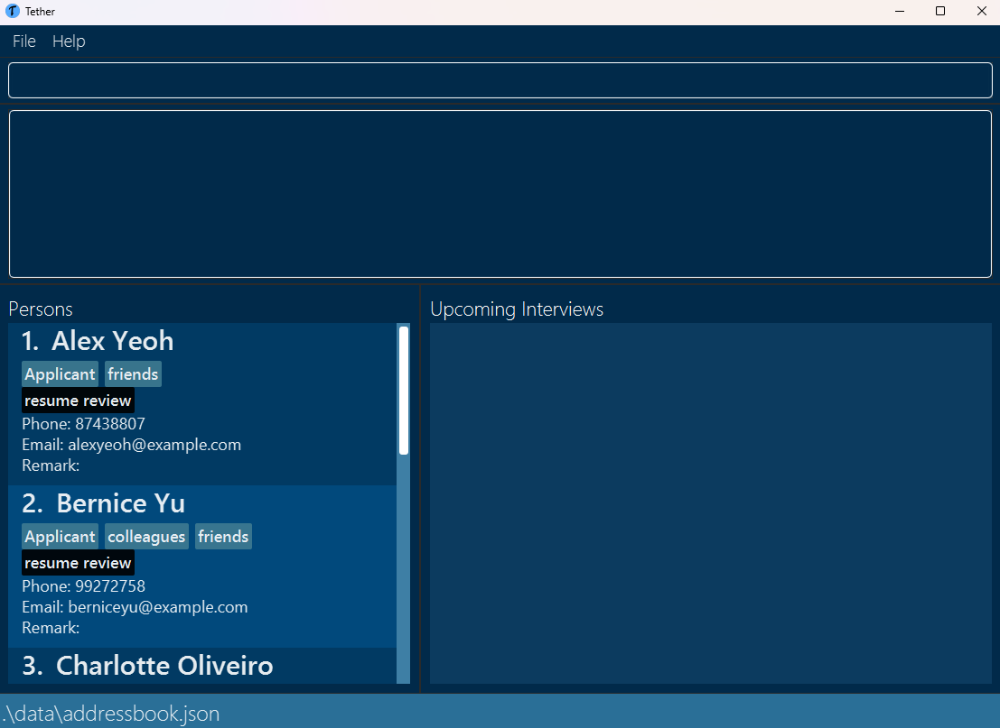
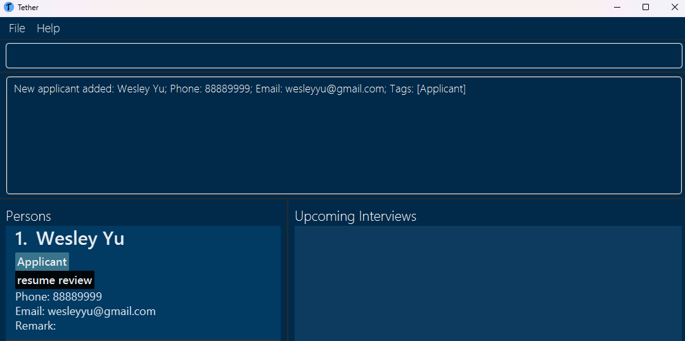
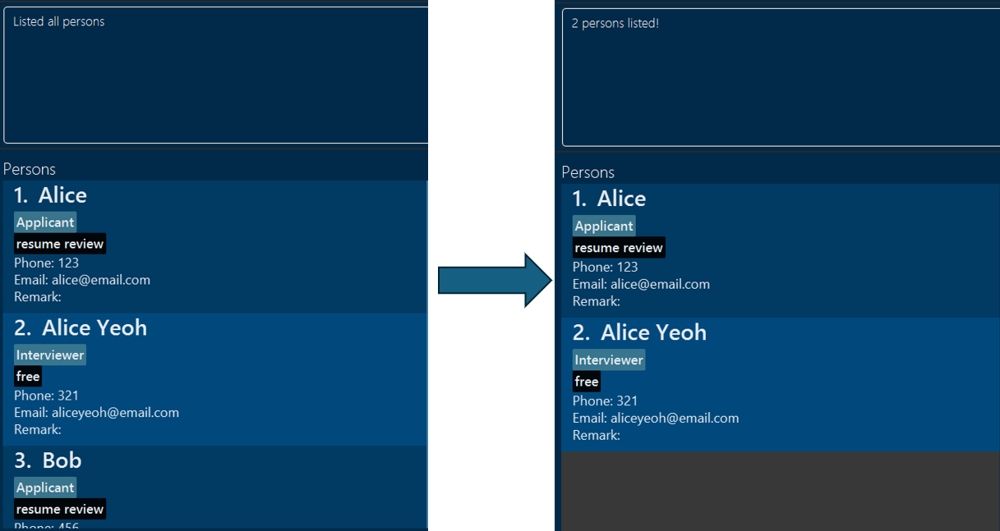
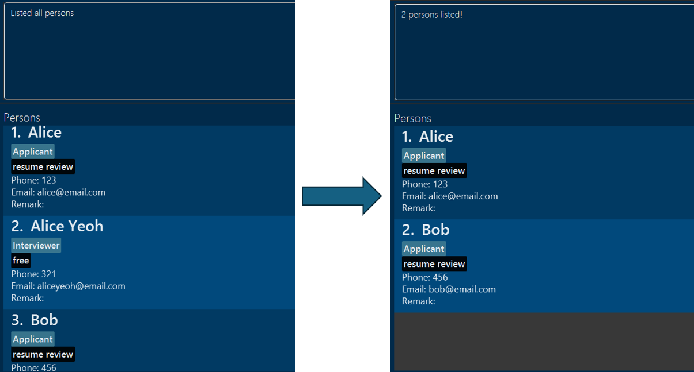

# Tether User Guide

_What if you could enjoy the dynamic nature of professional Applicant Tracking Systems combined with the timeless 
simplicity of tracking tools like Excel?_

Welcome to Tether, a free offline desktop application built for the everyday Hiring Manager (HM) such as yourself! Our application enables you to record applicant and interviewer details, schedule interviews, and access a high-level overview of applicant/interviewer/interview statistics. Tether is optimised for the HM that prefers a core set of features supported by a minimal, but smart, interface with no dependency on the internet. 

If you have found yourself here in this user guide, it probably means you need some help setting up and/or using our application. Thus, our user guide serves to
* Provide you with some context on what our application is and how it is different from traditional desktop applications,
* Help you install and run Tether, 
* Orientate you through Tether's interface, 
* Enumerate and explain the features available to you and, 
* List any planned enhancements to keep you appraised of how we're improving Tether.

There is also a List of Contents at the start, and a Glossary and FAQ section at the end to ease and expedite your perusal of our user guide.

Ready to make hiring management easy for yourself? Let's get started!

<!-- * Table of Contents -->
<page-nav-print />

-----------------------------------------------------------------------------------------------------------------

# List of Contents
- [Getting Started](#getting-started)
  - [Context on Tether](#context-on-tether)
  - [Quick Start](#quick-start)
  - [Gathering Your Bearings](#gathering-your-bearings)
- [Features](#features)
    - [Using Features Error-Free](#using-features-error-free)
    - [Adding an Applicant](#adding-an-applicant)
    - [Adding a Status to an Applicant](#adding-a-status-to-an-applicant)
    - [Adding an Interviewer](#adding-an-interviewer)
    - [Adding a Status to an Interviewer](#adding-a-status-to-an-interviewer)
    - [Adding a Remark to a Person](#adding-a-remark-to-a-person)
    - [Adding an Interview](#adding-an-interview)
    - [Listing All Persons](#listing-all-persons)
    - [Listing All the Interviews](#listing-all-interviews)
    - [Finding Persons](#finding-persons)
    - [Filtering Persons by Status](#filtering-persons-by-status)
    - [Filtering Interviews by Date](#filtering-interviews-by-date)
    - [Deleting a Person](#deleting-a-person)
    - [Deleting an Interview](#deleting-an-interview)
    - [View Overall Statistics](#view-overall-statistics)
    - [Clear All Existing Data](#clear-all-existing-data)
    - [Exiting the Program](#exiting-the-program)
- [Saving your Data](#saving-your-data)
- [Planned Enhancements and Known Issues](#planned-enhancements-and-known-issues)
- [Glossary](#glossary)
- [FAQ](#faq)
- [Command Summary](#command-summary)

--------------------------------------------------------------------------------------------------------------------
# Getting Started

This crucial section is where your journey with Tether starts. Here, you may learn the context for Tether, how to set up and run Tether, the structure of the application, and where to find help quickly if you need it. For terms which we feel may be a little technical or require further contextualising, we add numbering like so **[0]** beside them and then define those terms in our [Glossary](#glossary).

## Context on Tether

Tether is not your typical application that you may download off an app-store and directly launch from your desktop. It is an offline application that launches from and runs entirely through your computer's [_Command Line Interface_ (CLI)](https://aws.amazon.com/what-is/cli/#:~:text=A%20command%20line%20interface%20operating%20system%20using%20your%20keyboard) **[1]** which is a medium through which you directly interact with your computer system.

The way Tether works is, once you set up and launch the application from the CLI (as you will learn below in [Quick Start](#quick-start)), you type-in commands into a [_Graphical User Interface_ (GUI)](https://www.britannica.com/technology/graphical-user-interface) **[2]** to use the application. We employ this modus operandi to cut down on visual-noise such as buttons and click-away popups, and allow you to focus your hands only on the keyboard.

In short, **if you can type fast**, Tether can get your hiring management tasks done faster than traditional GUI apps.

Further, the data you create on Tether will not be saved in any online platform, but locally in your computer in a [json](https://developer.mozilla.org/en-US/docs/Learn/JavaScript/Objects/JSON) **[3]** file. You may even directly edit your data in this file if need be and the changes will be reflected when you (re)launch Tether. The benefit of this is that if you need a quicker way of fixing or updating your data than using commands on our application, the json file is at your disposal.

Below you will see a listing and explanation of the exact commands you will need to use our available [features](#features).


## Quick Start

1. [Ensure](https://www.baeldung.com/java-check-is-installed) you have Java 11 or above installed in your Computer. This is a crucial step as Java, one of the world's most prominent programming languages, is the backbone of how our application operates.
    - If you do not have Java 11, download it from [here](https://www.oracle.com/java/technologies/javase/jdk11-archive-downloads.html)
      - For **Mac** users, you are recommended to download from [here](https://www.azul.com/downloads/?version=java-11-lts&os=macos&architecture=arm-64-bit&package=jdk-fx) to prevent any issues running the `tether.jar` file.
    -  Help with configuring correct Java version: [Windows](https://www.happycoders.eu/java/how-to-switch-multiple-java-versions-windows/) | [MacOS](https://stackoverflow.com/questions/21964709/how-to-set-or-change-the-default-java-jdk-version-on-macos) | [Linux](https://www.baeldung.com/linux/java-choose-default-version)


2. Click to download the latest `tether.jar` from [here](https://github.com/AY2324S2-CS2103T-F11-3/tp/releases/tag/v1.3).


3. Open your _file manager_ (search for File Explorer in your computer for Windows, or Finder for Mac), and navigate to your _downloads_ section


4. Copy the downloaded `tether.jar` to a new folder that you will use as the _home folder_ for Tether (from here on, let _tether_folder_ refer to this home folder). You may choose to create this new folder in the downloads section as well, for later convenience. 


5. Open a _command line interface_ (Command Prompt in Windows or Terminal in Mac) and follow these steps:
   * Once you open the interface, you will notice an almost blank screen with a single line and a cursor waiting for input. This means you are now in your _home directory_ of your computer. 
   * Type in the command `cd` ("change directory") to navigate to the folder you put the jar file in. 
     * Example: if your home directory starts at "~" and you wish to navigate to _downloads_, first type `cd downloads` and press enter to navigate into _downloads_ and then type `cd tether_folder` to navigate into your _tether_folder_ 
     * **Tip** for Mac Users: when you first open the CLI and start at your home directory, type in `cd` and then simply drag and drop the _tether_folder_ into the terminal. Press enter and you will directly find yourself in the _tether_folder_.
   * Now that you are in the _tether_folder_, enter `java -jar tether.jar` command and press enter to run the application. A GUI similar to the below should appear in a few seconds. Note how the app contains some sample data.<br>



--------------------------------------------------------------------------------------------------------------------

# Gathering your bearings ##
Before delving into the features, we want you to give you a brief tour on how to use our application.

## The structure of Tether


1. Taskbar: Where you may click on either the _File_ or _Help_ buttons.
2. Command Box: Where you enter commands (which are later forwarded to the CLI for execution).
3. Result Box: Where success or error messages, if any, for executed commands are displayed
    * Note that the Result Box may not necessarily refresh everytime a new command is executed. This may happen if, as an example, a command incurs a fatal error before it can generate a result.
4. Person/Interview Card: Where the details of each person **[4]** and interview you add are displayed
5. Path to saved data: The location (i.e. the place you created the _tether_folder_ from earlier) of the folder _data_ in which your person/interview data file _addressbook.json_ is saved. If you followed the instructions in the [Quick Start](#quick-start) closely, when you first run and use the application using `java -jar`, the _data_ folder should be automatically created in the same _tether_folder_ that you created to store the `tether.jar` file.
    * **Note**: If you move the _data_ folder or the enclosed _addressbook.json_ file to some other location, the application will **not** load with your existing data. This is because the application searches for the data folder in the **same** location as your `tether.jar` file. The path to saved data will **not** update itself if you move the _data_ folder. To summarize, just do not touch the _data_ folder or the _addressbook.json_ file as doing so would cause issues with your existing data.

## Help yourself!

Simply execute `help` or press the _Help_ button in the taskbar to launch a help window that shows the list of commands.

--------------------------------------------------------------------------------------------------------------------

# Features

Now that we've gone over the basics, let's dive into how you may use Tether for your most essential hiring management tasks!


## Using Features Error-Free

**Notes about the command format:**<br>

* Most commands are in the format `commandname [parameters]`.


* Take note of parameters **[5]** that have special prefixes such as `n/` for name and `e/` for email.


* Command names are case-sensitive.<br>
  e.g if you type in `ADD_APPLICANT` instead of `add_applicant`, it is interpreted as an invalid command.


* Tether will give appropriate feedback if any parameter constraints for commands are violated. However, this feedback may not always be very specific as to exactly which parameters are violated and in what way. To help you in this matter, we do list parameter constraints
  along with the commands that first use them (i.e. the same parameter constraints will not be
  explained everytime the parameter is used, only the first time).


* Tether will ignore leading and trailing whitespaces for all parameters except for the `filter_by_status` command.


* Tether will ignore extraneous parameters for commands that do not take in any parameters (`help`, `clear`, `exit`, `view_overall_statistics`). For example, if you attempt to execute `help 123`, it will be interpreted as `help`.


* If you are using a PDF version of this document, be careful when copying and pasting commands that span multiple lines
  as space characters surrounding line-breaks may be omitted when copied over to the application.
  </box>

**Consequences of adding invalid values for fields:**

* The application may not load any data at all upon launch.
    * If you make invalid edits to the _addressbook.json_ file such as changing a person's name to be an emoji, Tether will launch with no data until invalid fields are rectified.
    * The definition of an invalid edit is far from exhaustive, but a good indicator is that if the edit violates basic parameter constraints of the fields (which are explained below), then it is likely to be invalid.


* The application may fill up with incoherent data.
    * Tether may not always check against invalid edits. If you attempt to add illogical data such as editing all person emails in the _addressbook.json_ to be duplicated or add interviews whose dates precede the current date, the application will allow you to do so at your expense.
    * To be safe, do check what parameters you use for commands and be careful editing the _addressbook.json_ file.

### Adding an Applicant:

One of the first steps in the hiring pipeline is when an applicant submits their name for consideration. 

To record an applicant and their contact details in Tether, simply execute `add_applicant n/NAME p/PHONE e/EMAIL` and the applicant will appear under the _Persons_ column as seen via the example usage below.

**Example usage**:
* `add_applicant n/Wesley Yu p/88889999 e/wesleyyu@gmail.com`



**Parameter constraints**:
* Names can only contain alphanumeric **[6]** characters and spaces, and should not be blank.
* Phone numbers must be at least 3 digits long and strictly only contain numbers (i.e. no spaces or dashes).
* Emails should be of the format local-part@domain and adhere to the following constraints:
  * The local-part should only contain alphanumeric characters and the special characters (+_.-), excluding the parentheses. The local-part may not start or end with any special characters. 
  * This is followed by a '@' and then a domain name. The domain name is made up of domain labels separated by periods.
   The domain name must:
    - End with a domain label at least 2 characters long.
    - Have each domain label start and end with alphanumeric characters.
    - Have each domain label consist of alphanumeric characters, separated only by hyphens, if any.

**Notes**:
* No two applicants can have the same email or phone number.
  * For two applicants to be considered different, they must have different emails **and** different phone numbers.
  * If you are a discrete mathematics enthusiast, this is equivalent to `~(sameEmail || samePhone) = ~sameEmail && ~ samePhone = differentEmail && differentPhone`.
* Applicants' remark field will be empty by default and can only be edited later with the `remark` command (described below).
* An applicant will have an _Applicant_ tag (as pictured above, below the name _Wesley_) by default. Customising this tag or adding additional tags is not currently possible.

### Adding a Status to an Applicant:

Now that you know how to add an applicant, it would be nice to record their position in your hiring pipeline at any given time for later review. This is where tagging applicants by status is handy.

Simply execute `applicant_status PHONE s/STATUS` where PHONE is the target applicant's phone number and STATUS may **only** be any one of:
- "Resume review": for when an applicant has only just entered your hiring pool. Note that this is the default status an applicant receives when first added.
- "Pending interview": for when you are satisfied with an applicant's potential and have set up or are in the process of scheduling an interview for them.
- "Completed interview": as the natural successor to the previous status.
- "<span style="color: orange;">Waiting list</span>": if you - or more specifically the interviewer - are not quite sure about an applicant's future.
- "<span style="color: green;">Accepted</span>": in the case that an applicant has impressed their interviewer enough for you to send a happy email as soon as possible.
- "<span style="color: red;">Rejected</span>": for the unfortunate case....

**Example Usage**

* `applicant_status 98362254 s/accepted`.


**Parameter Constraints**
* A STATUS may strictly only be any of the statuses enumerated above. However, STATUS is case-insensitive i.e. `s/accepted` is as valid as `s/AcCepTed`.
* If multiple valid status parameters are used, such as `add_applicant PHONE s/accepted s/rejected`, then only the last status will be considered i.e, the applicant's status will become _rejected_.
* If multiple valid statuses are given through one status parameter, such as `add_applicant PHONE s/accepted rejected`, then an error will be displayed since "accepted rejected" is not any one of the valid statuses. Simply put, the clause immediately following an `s/` prefix is considered as one status.

**Notes**:

* The `applicant_status` command **overwrites** the applicant's current status. Ultimately, we want you to be able to pivot your applicants to any stage of the hiring pipeline.
* If you schedule an interview with a particular applicant, the applicant's status will change automatically from _resume review_ to _pending interview_. Conversely, if you delete an interview involving an applicant, their status will revert to _resume review_ regardless of what their previous status was.

### Adding an Interviewer:
Recording all potential applicants is one thing, but to meaningfully schedule interviews for them, you also need a host of interviewers and their details.

To record an interviewer and their contact details in Tether, simply execute `add_interviewer n/NAME p/PHONE e/EMAIL` and the interviewer will appear under the _Persons_ column as seen via the example usage below.

**Example Usage**
* `add_interviewer n/Yash p/99998888 e/yash@gmail.com`


**Notes**:
* Similar to applicants, no two interviewers can have the same email or phone number. 
* Interviewers' remark field will be empty by default and can only be edited later with the `remark` command (described below).
* An interviewer will have an _Interviewer_ tag (as pictured above, below the name _Yash_) by default. Customising this tag or adding additional tags is not currently possible.


### Viewing the Status of an Interviewer:

Now that you know how to add an interviewer, it would be nice to record their availabilities at any given time for subsequent interview scheduling. Happily however, there are no commands here to manage interviewer statuses manually!

Tether is capable of tagging an interviewer with a status _automatically_ when an interview concerning the respective interviewer is added. As a specific example, if an interview is scheduled between applicant Wesley and interviewer Yash, then Yash is given a status of _interview with wesley_. If an interviewer has no scheduled interviews, then their status will be _free_. 

At any time, an interviewer's status can only either be _free_ or a list of _interview with..._ for all the applicants they are interviewing.

As more interviews are added, the interviewer's statuses stack on top of each other like so: 


Conversely, if an interview is deleted, the respective status is automatically removed from the interviewer's status stack.

### Adding a Remark to a Person:

Once you have Persons in Tether, wouldn't it be nice to annotate them with helpful remarks?

Simply execute `remark INDEX r/REMARK` where INDEX is the serial number of the person in the list and the REMARK will appear under the respective person. 

**Example Usage**

* `remark 1 r/Confident` would add the 
_Confident_ remark to the person at number 1.

**Parameter Constraints**
* The INDEX of the person to be removed has to be valid, meaning it should correspond to an existing person in the current list. For example, executing `remark -2 r/Confident` when there can't be a negative amount of people, or `remark 100 r/Confident` when there's only 20 people, will both lead to errors.

**Notes**
* If you only execute `remark INDEX` without any parameters, at all the remark of the person at that index will be removed.


### Adding an interview:

Now comes a very meaty part of hiring management - scheduling interviews. And to do so, simply execute `add_interview desc/DESCRIPTION date/DATE st/START_TIME et/END_TIME a/APPLICANT_PHONE_NUMBER i/INTERVIEWER_PHONE_NUMBER`

The following example usage demonstrates the effect of adding an interview in this manner:

**Example Usage**
* `add_interview desc/Technical Round date/2024-11-11 st/12:00 et/15:00 a/12345678 i/87654321`.


**Parameter Constraints**
* If the interview does not require a description, simply use an empty parameter`desc/`.
* Dates must be in `YYYY-MM-DD` format.
* Start and end times must be in either `HH:MM` or `HH:MM:SS` format, and the start-time cannot precede the end-time. Timings follow the 24-hour format.

**Notes**:
* You can still schedule new interviews for applicants who have already been rejected or accepted. This is simply to accommodate, amongst other possibilities, the possibility of follow-up interviews.
* Scheduling interviews on dates that have already lapsed are allowed, to support you retroactively recording interviews.
* If you attempt to use an interviewer or applicant phone number that does not exist to schedule an interview, tether will tell you that the _Person you are looking for does not exist_. 
* If you use a valid interviewer and applicant phone number but use them in the opposite order in which they are required (i.e. using an interviewer phone number after `a/` or an applicant phone number after `i/`), Tether will indicate to you that the phone number you keyed in is not a valid applicant or interviewer phone number.

### Listing all Persons:

When you've added several applicants or interviewers to Tether, it's helpful to see them all together with their details.

The list of persons and their details is typically shown on the left side of the screen in the GUI, and it updates automatically whenever new persons are added. However, there are also commands like `find` and `filter` (explained below) that can change the list shown. If you've used any of these commands and want to go back to seeing the original, unfiltered list of persons, just use the command `list_persons`.

### Listing all Interviews:

Similar to persons, after adding several interviews to Tether, it's useful to see them all together with their details.

The list of interviews and their details is usually displayed on the right side of the GUI, and it updates automatically when new interviews are added. However, there is a `filter` command (explained below) that can change the list displayed. If you've used this command and want to return to seeing the original, unfiltered list of interviews, simply use the command `list_interviews`.

### Finding Persons:

After adding multiple persons into Tether, you may find yourself having to manually scroll to locate a specific person. 
The ```find``` command is useful here to save you time in locating such persons provided you already know at least one of 
the following 3 details of the person: their email, name or phone number.

```find``` can also be used to find multiple persons at once. You can provide multiple parameters after the initial 
`find_email`, `find_phone` or `find_name` and all persons that match any of the parameters for these commands will be displayed. 

To find a person or persons, execute `find_email/name/phone PARAMETER1 PARAMETER2...` such as in the example usages illustrated below:

**Example Usage**:

**Single parameter:**
Executing ```find_name Alice``` will list all persons containing the name ```Alice```:



**Multiple parameters:**
Executing ```find_phone 123 456``` will list all persons with the phone number `123` or `456` as seen below:



**Notes**:
* The ```find``` command queries the original unfiltered list of persons each time, meaning that sequentially executed ```find``` commands are not applied on top of the previous ones.
* If you use email or phone number, note that they have to match exactly to locate the person entry if it exists.
* If you use name, a full name is not required but the name provided should be complete. Otherwise, there will also be no matching persons. For example, `find_name Alice` will bring up _Alice_ and _Alice Yeoh_ but `find_name Ali` will not return any matches.
* The command accepts any parameters, including invalid ones. However, no matching persons will be displayed in such cases. An example of an invalid parameter is `find_email Alice`.
  * However, for multiple parameters, all the parameters should at least be of the same type. For example, ```find_phone``` should only be followed by valid phone number(s), not a mix of phones, emails and names.

### Filtering Persons by Status:

What if you have no information about an applicant or interviewer's name, phone or email though? Fret not, for the `filter_by_status` command enables you to narrow down the current list of persons on the basis of their current status.

Simply execute `filter_by_status STATUS`, and the displayed list will update to show only persons with the required STATUS.

**Example Usage**
* `filter_by_status free` will display all interviewers with status _free_.
* `filter_by_status resume review` will display all applicants with status _resume review_.

**Parameter Constraints**
* STATUS may only be any one of the valid statuses enumerated in [adding a status to an applicant](#adding-a-status-to-an-applicant) and [viewing the status of an interviewer](#viewing-the-status-of-an-interviewer) above. 

**Notes**
* As of now, there is only support for a single status parameter.
* If you want to apply filters one-after-the-other seamlessly, you will have to do this manually. For example, after applying `filter_by_status free`, you will need to `list_persons` again before applying `filter_by_status interview with wesley`. 
  * If you don't execute `list_persons`, then the filters will stack on top of the other and you will be searching for interviewers with status _interview with wesley_ among interviewers with status _free_, which will logically result in finding no interviewers at all.  
* If there are no persons with the given status, Tether will simply inform you that there are no persons found and the displayed list will remain unchanged.
* Statuses must be matched exactly i.e. `filter_by_status interview with wes` will not match an interviewer with status _interview with wesley_.

### Filtering Interviews by Date:

Navigating through a dense schedule to find specific interviews can be daunting. 
Tether simplifies this with the `filter_interviews_by_date DATE` command, allowing you to instantly locate all interviews scheduled for the given DATE.

To view your full interview schedule, simply use the `list_interviews` command.

**Example Usage**
* For instance, to see all interviews on May 5th, 2024, you would use `filter_interviews_by_date 2024-05-05`.

**Parameter Constraints**
* DATE must be in YYYY-MM-DD format and must be a valid date.

**Notes**
* If there are no interviews with the given date, Tether will simply inform you that there are no interviews found and the displayed list will remain unchanged.
* If you want to apply filters one-after-the-other seamlessly, you will have to do this manually. For example, after applying `filter_interviews_by_date 2024-05-05`, and if there exists interviews on that date, you will need to `list_interviews` again before applying `filter_interviews_by_date 2024-06-06`.

### Deleting a Person:

If you're confident in removing a person from Tether if - for example - an interviewer leaves your company or an applicant is out of the hiring process, then execute ```delete_person PHONE``` and the person with the given PHONE will be removed **permanently**.

**Example Usage**:

* ```delete_person 81239123``` would delete that
  person.

### Deleting an Interview:

If you're confident in unscheduling an interview, perhaps due to changed availability or an unexpected clash, then execute ```delete_interview INDEX``` and the interview numbered at INDEX will be removed **permanently**.

**Example Usage**:

* ```delete_interview 1``` would delete the first interview in the list.

### View Overall Statistics:

Core features such as adding, finding, status management and deleting are likely going to be your bread and butter as a hiring manager. However, often you may be tasked to analyse and report certain statistics that may be tedious to compute manually. 

Tether has some basic support for viewing statistics, particularly: 
- Total number of applicants as well as applicant numbers by status
- Total number of interviewers as well as interviewer numbers by status
- Total number of interviews

A simple example usage would be `view_overall_statistics` to get a result as such: 


### Clear all existing data:

If you made multiple mistakes and wish to rebuild your hiring data from scratch, the ```clear``` command deletes all existing data in Tether, giving you the fresh start you require.

**Notes** 
1. This action is irreversible. The moment you enter the command and see the success message _Addressbook has been cleared!_, **all** your data will be deleted permanently. Do exercise caution with this particular command by making an independent copy of your data before clearing it.

### Exiting the program:

If you're clocking out for the day, either execute ```exit``` directly or press the _File_ button in the taskbar and then press _Exit_ to quit Tether.

--------------------------------------------------------------------------------------------------------------------

## Saving Your Data

Tether's person and interview data are saved in the hard disk **[7]** automatically after any command that changes the data.

There is **no need** to save manually.

--------------------------------------------------------------------------------------------------------------------

## Planned Enhancements and Known Issues

Tether is always a Work-In-Progress as we are constantly refining our application for your needs. Listed below are some of our planned enhancements as well as current limitations, to keep you abreast of the current state of our application.

### Planned Enhancements
1. Managing Persons/Interviews
   * An `edit` command to amend any of the fields of a person or interview.
   * A `tag` command and `t/` parameter to add and edit custom tags for persons/interviews.
   * `undo` and `redo` for commands.
   * Separate lists in the GUI for Applicants and Interviewers as opposed to displaying them together in one Persons list.
<br>
<br>
3. Interviews
    * Delete interviews automatically once an applicant or interviewer is deleted.

### Known Issues
1. User Display
    * In general, we focused on a clean interface with minimal moving parts. For this reason, there are many possible areas for improvement in our UI that we are ready and open to work on
    * Currently, adding multiple interviews may cause the interviewer's card to expand beyond its bounds.
    * Adding extremely long fields for a person/interview may cause the field in the respective cards to spill out of bounds.
<br>
<br>
2. Error Messaging
   * Some of our error messages could be more specific in why the command triggered an error and how to rectify this. For now, we wanted to minimise the risk of information overload in lieu of very detailed feedback.

--------------------------------------------------------------------------------------------------------------------

## Glossary
1. Command Line Interface (CLI) : It is a software mechanism you use to interact with your computer using your keyboard.
2. Graphical User Interface (GUI) : It is a user interface that allows users to interact with graphical icons like buttons.
3. JSON: A text-based format for representing structured data involving specific fields and their values.
3. Person : Refers to an applicant or an interviewer.
4. Parameter : Information to be supplied by the user into commands.
6. Alphanumeric : Alphabets `a-z` (both lower and uppercase) and numbers `0-9`.
7. Hard disk : The storage component of your computer.
--------------------------------------------------------------------------------------------------------------------

## FAQ

**Q**: How do I transfer my data to another Computer? <br>
**A**: Install the app in the other computer and overwrite the empty data file it creates with the file that contains
the data of your previous Tether home folder.

--------------------------------------------------------------------------------------------------------------------

## Command summary

| Action                        | Format, Examples                                                                                                                                                                                                      |
|-------------------------------|-----------------------------------------------------------------------------------------------------------------------------------------------------------------------------------------------------------------------|
| **Add Applicant**             | `add_applicant n/NAME p/PHONE e/EMAIL` <br> e.g., `add_applicant n/John Doe p/81239123 e/johndoe123@gmail.com`                                                                                                        |
| **Change Applicant Status**   | `applicant_status PHONE s/STATUS` <br> e.g., `applicant_status 81239123 s/accepted`                                                                                                                                   |
| **Add Interviewer**           | `add_interviewer n/NAME p/PHONE e/EMAIL` <br> e.g., `add_interviewer n/Jane Doe p/81239123 e/janed@example.com`                                                                                                       |
| **Change Interviewer Status** | `interviewer_status PHONE s/STATUS` <br> e.g., `interviewer_status 81239123 s/free`                                                                                                                                   |
| **Add a Remark to Person**    | `remark INDEX r/REMARK` <br> e.g, `remark 1 r/Confident`                                                                                                                                                              |
| **Add Interview**             | `add_interview desc/DESCRIPTION date/DATE st/START_TIME et/END_TIME a/APPLICANT_PHONE i/INTERVIEWER_PHONE`<br> e.g., `add_interview desc/Interview with John date/2024-11-11 st/10:00 et/11:00 a/81239123 i/91238123` |
| **Delete Person**             | `delete_person PHONE` <br> e.g., `delete_person 81239123`                                                                                                                                                             |
| **Delete Interview**          | `delete_interview INDEX`<br> e.g., `delete_interview 1`                                                                                                                                                               |
| **List Interviews**           | `list_interviews`                                                                                                                                                                                                     |
| **List Persons**              | `list_persons`                                                                                                                                                                                                        |
| **Find Persons**              | `find_[email/name/phone] [parameter 1]...` <br> e.g., `find_name Alice` or `find_phone 123 456 789`                                                                                                                   |
| **Filter Persons by Status**  | `filter_by_status STATUS`  <br> e.g., `filter_by_status free`                                                                                                                                                         |
| **Filter Interviews by date** | `filter_interviews_by_date DATE`  <br> e.g., `filter_interviews_by_date 2024-05-05`                                                                                                                                   |
| **View Overall Statistics**   | `view_overall_statistics`                                                                                                                                                                                             |
| **Clear All Existing Data**   | `clear`                                                                                                                                                                                                               |
| **Exit**                      | `exit`                                                                                                                                                                                                                |
| **Help**                      | `help`                                                                                                                                                                                                                |
